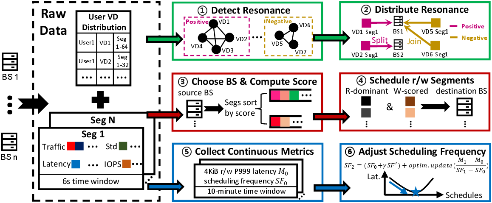

# Omar

This folder contains the source code for Omar, a proactive and reactive mixed scheduler designed for cloud block storage systems. **Note:** The code cannot be run directly and must be adapted according to your specific block storage system implementation.



## Overview

Omar is an intelligent scheduling system that combines proactive and reactive strategies to optimize block storage performance in cloud environments. It dynamically adjusts scheduling decisions based on real-time metrics and workload patterns.

## Traces

We have collected per-I/O block traces from more than 1,000 Virtual Disks (VDs) in Alibaba's production environment. These comprehensive traces are publicly available at [Tianchi](https://tianchi.aliyun.com/dataset/210122) for research and development purposes.

## Getting Started

We have decoupled Omar from specific block storage services to make it as adaptable as possible to different block storage system implementations.

### Prerequisites

- Python 3.8 or higher
- C++ compiler with C++11 support
- pybind11 development headers

### Installation

1. **Install Python Dependencies**

    Install the required Python packages:

    ```bash
    pip install pybind11 numpy networkx APScheduler torch
    ```

2. **Compile C++ Extension**

    Compile the C++ binary using pybind11 to generate the `read_and_merge.so` library. This binary uses `mmap` to efficiently read real-time segment metrics from the blockmaster process:

    ```bash
    g++ -shared -o read_and_merge.so -O3 -fPIC ./cpp_code/read_and_merge.cpp $(python -m pybind11 --includes) -std=c++11
    ```

3. **Run the Scheduler**

    Start the scheduler with the Omar algorithm:

    ```bash
    python main.py --algo omar
    ```

    **Note:** We also provide a random scheduler implementation in [`random_algo.py`](../algorithm/random_algo.py) to demonstrate how to integrate other scheduling algorithms.

## Architecture

### Input/Output

- **Input:** The scheduler receives merged statistical metrics (`cpp_res`) from the block storage system
- **Output:** Scheduling decisions are transmitted to the blockmaster through RPC calls
- **Additional Inputs:** The resonance-based allocator requires `w_traffic`, `r_traffic`, and `user_volume_map` mappings

## Configuration

The scheduler can be configured through various command-line arguments:

- `--t_len`: Test duration in seconds (default: 1800s)
- `--interval`: Scheduling interval in seconds (default: 3s)
- `--map`: Mapping between VDs and blockservers, it maintains the initial status of the cluster
- `--algo`: Scheduling algorithm to use (required)
- `--debug`: Enable debug mode
- `--log_level`: Set logging level (default: debug)

## Contributing

**System Requirements:** A minimal Omar deployment typically requires approximately 10 client machines, 10 blockservers, and 3 blockmasters. When adapting Omar to your block storage system, focus on the following key areas:

1. Implementing the appropriate data preprocess functions for your metrics
2. Adapting the RPC interface to your BlockMaster
3. Configuring the traffic-to-volume and user-to-volume mappings
4. Adjusting the scheduling parameters for your environment
